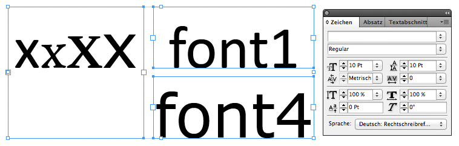
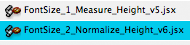
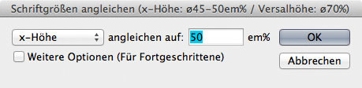
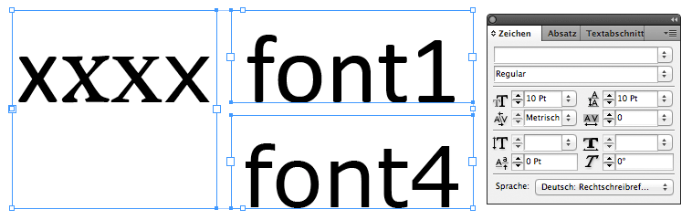

Normalize Font Size (only InDesign yet, help is highly appreciated)
-------------------
Did you ever wondered why some fonts look bigger than others?
Sometimes it’s the difference in style but most of the time you can’t tell, cause you’re distracted by random scales.
This tool helps you to correct the distraction, so you can clearly see the character of a typeface in comparison to others, while keeping the same point size! and exactly the same quality. (overal proportion, rendering, …)

language support: english and german  

# INSTALLATION

Quick Instructions to install Scripts in Adobe Indesign:  
http://www.youtube.com/watch?v=v1Kuy_eJMLU&noredirect=1 (2min video) 
http://www.danrodney.com/scripts/directions-installingscripts.html (described within 3 screenshots)

# Use
1. Select a textframe or single characters

10pt — Original

2. Double click the normalize script

3. Set the prefered size relation (percentage per fontsize) or leave defaults

Basic Interface (detects the system language and changes between english and german)
  
4. Be happy :)

10pt — Normalized

(5. When you mix Typefaces, finetune their size relation as you like it.)

//ToDo: Video Presentation (but it is somehow self explanatory, just try it :)

# Theory Impressions
sorry, only in german yet …

# Acknowledgement
The Indesign scripts are based on Gerald Singelmanns "SetVisualCharSize.jsx" (http://www.indesign-faq.de/de/versal-und-andere-hohen-angleichen)

# Feedback
If you encounter any bug or have some recommendations to improve the script please feel free to contact me. (m.vongebhardi<ät>gmail.com)

